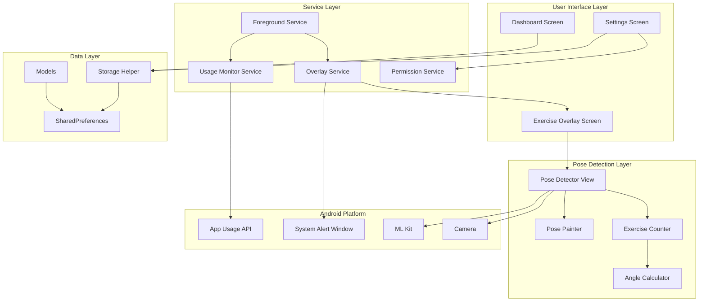
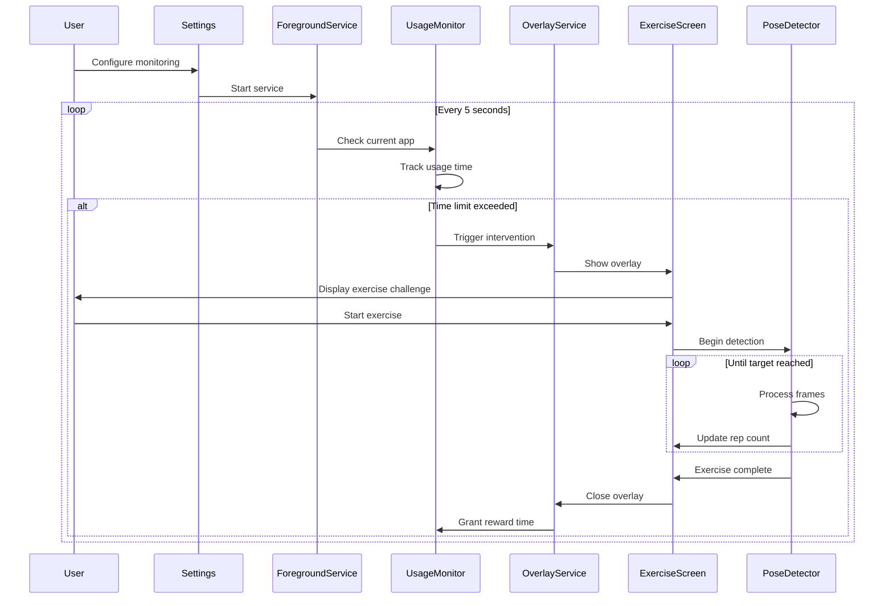

# Design Document

## Overview

The Fitness-Enforced Digital Wellbeing app is a Flutter Android application that combines ML-powered pose detection with app usage monitoring to create a unique digital wellbeing solution. The system operates as a persistent background service that tracks social media usage, enforces time limits, and requires users to complete physical exercises (verified through real-time pose detection) before granting continued access.

### Key Design Principles

1. **Non-Intrusive Monitoring**: Background service runs efficiently with minimal battery impact
2. **Reliable Enforcement**: Overlay system cannot be bypassed without completing exercises
3. **Accurate Detection**: ML Kit pose detection ensures genuine exercise completion
4. **User Control**: Comprehensive settings allow customization of monitoring behavior
5. **Graceful Degradation**: System handles edge cases and interruptions smoothly

### Technology Stack

- **Flutter SDK**: >=3.10.0
- **ML Kit Pose Detection**: google_mlkit_pose_detection ^0.14.0
- **App Usage Tracking**: app_usage ^4.0.0
- **System Overlay**: system_alert_window ^2.0.0
- **Background Service**: flutter_foreground_task ^9.1.0
- **Camera Access**: camera (latest)
- **Local Storage**: shared_preferences (latest)
- **Target Platform**: Android SDK 21+ (Lollipop and above)

## Architecture

### High-Level Architecture Diagram



### System Flow



## Components and Interfaces

### 1. User Interface Components

#### DashboardScreen
**Purpose**: Display usage statistics and exercise completion metrics

**State Management**:
- `todayExerciseCount`: int
- `totalExerciseCount`: int
- `monitoredAppsUsage`: Map<String, Duration>
- `timeSaved`: Duration

**Key Methods**:
- `loadStatistics()`: Fetch data from storage
- `calculateTimeSaved()`: Compute reduction in social media time
- `refreshData()`: Update UI with latest statistics

**UI Elements**:
- Exercise completion cards (today/all-time)
- Per-app usage breakdown
- Time saved metric
- Visual charts/graphs

#### SettingsScreen
**Purpose**: Configure monitoring parameters and manage permissions

**State Management**:
- `selectedApps`: List<String> (package names)
- `usageTimeLimit`: int (minutes)
- `rewardTime`: int (minutes)
- `exerciseType`: ExerciseType enum
- `repCount`: int
- `isMonitoringEnabled`: bool

**Key Methods**:
- `loadInstalledApps()`: Query device for social media apps
- `validatePermissions()`: Check all required permissions
- `toggleMonitoring()`: Start/stop foreground service
- `saveSettings()`: Persist configuration
- `updateServiceConfig()`: Send new settings to running service

**UI Elements**:
- App selector (multi-select list)
- Time limit slider/dropdown
- Reward time selector
- Exercise type picker
- Rep count selector
- Monitoring toggle switch
- Permission status indicators

#### ExerciseOverlayScreen
**Purpose**: Full-screen exercise challenge interface shown via system overlay

**State Management**:
- `exerciseType`: ExerciseType
- `targetReps`: int
- `currentReps`: int
- `isExercising`: bool
- `showSuccessAnimation`: bool

**Key Methods**:
- `startExercise()`: Initialize camera and pose detection
- `onRepCompleted()`: Update counter
- `onExerciseComplete()`: Trigger success flow
- `closeOverlay()`: Dismiss and grant reward time

**UI Elements**:
- Exercise name and instructions
- Start button
- Camera view with pose overlay
- Rep counter/timer display
- Success animation
- Form feedback indicators

### 2. Service Layer Components

#### ForegroundService
**Purpose**: Persistent background service coordinating all monitoring activities

**Implementation**: Extends `flutter_foreground_task` TaskHandler

**Key Methods**:
- `onStart(DateTime timestamp, TaskStarter starter)`: Initialize service
- `onRepeatEvent(DateTime timestamp)`: Called every 5 seconds
- `onDestroy(DateTime timestamp)`: Cleanup on service stop
- `onNotificationPressed()`: Handle notification tap

**Responsibilities**:
- Maintain persistent notification
- Coordinate usage monitoring
- Trigger overlay interventions
- Manage service lifecycle
- Handle auto-restart after crashes

**Configuration**:
```dart
FlutterForegroundTaskOptions(
  interval: 5000, // 5 seconds
  isOnceEvent: false,
  autoRunOnBoot: true,
  allowWakeLock: true,
  allowWifiLock: false,
)
```

#### UsageMonitorService
**Purpose**: Track app usage and enforce time limits

**State**:
- `monitoredApps`: Set<String>
- `usageStartTime`: Map<String, DateTime>
- `cumulativeUsage`: Map<String, Duration>
- `rewardTimeExpiry`: DateTime?
- `usageTimeLimit`: Duration
- `rewardDuration`: Duration

**Key Methods**:
- `checkCurrentApp()`: Query foreground app using app_usage
- `updateUsageTime(String packageName)`: Increment usage counter
- `isLimitExceeded()`: Check if intervention needed
- `isInRewardPeriod()`: Check if user has active reward time
- `resetUsageTimer()`: Clear usage after exercise completion
- `grantRewardTime()`: Set reward period expiry
- `persistUsageData()`: Save to storage

**Algorithm**:
```dart
Future<void> checkCurrentApp() async {
  final endDate = DateTime.now();
  final startDate = endDate.subtract(Duration(seconds: 10));
  final usageList = await AppUsage().getAppUsage(startDate, endDate);
  
  // Find most recent app
  final currentApp = usageList.isNotEmpty ? usageList.last.packageName : null;
  
  if (currentApp != null && monitoredApps.contains(currentApp)) {
    if (isInRewardPeriod()) {
      // Allow access during reward time
      return;
    }
    
    updateUsageTime(currentApp);
    
    if (isLimitExceeded()) {
      await OverlayService.showExerciseChallenge();
    }
  }
}
```

#### OverlayService
**Purpose**: Manage system alert window overlay display

**Key Methods**:
- `showExerciseChallenge()`: Display full-screen overlay
- `closeOverlay()`: Dismiss overlay
- `isOverlayShown()`: Check current state
- `requestPermission()`: Request SYSTEM_ALERT_WINDOW permission

**Implementation**:
```dart
static Future<void> showExerciseChallenge() async {
  await SystemAlertWindow.showSystemWindow(
    height: screenHeight,
    width: screenWidth,
    gravity: SystemWindowGravity.CENTER,
    notificationTitle: "Complete Exercise to Continue",
    notificationBody: "Time limit reached",
    prefMode: SystemWindowPrefMode.OVERLAY,
  );
}
```

**Overlay Prevention**:
- Monitor overlay state continuously
- If user dismisses externally, immediately reopen
- Only close when exercise is verified complete

#### PermissionService
**Purpose**: Centralized permission management

**Key Methods**:
- `checkAllPermissions()`: Verify all required permissions
- `requestUsageStatsPermission()`: Open usage access settings
- `requestOverlayPermission()`: Open overlay settings
- `requestCameraPermission()`: Runtime camera permission
- `hasUsageStatsPermission()`: Check PACKAGE_USAGE_STATS
- `hasOverlayPermission()`: Check SYSTEM_ALERT_WINDOW
- `hasCameraPermission()`: Check CAMERA

**Permission Flow**:
```dart
Future<bool> checkAllPermissions() async {
  final usageStats = await hasUsageStatsPermission();
  final overlay = await hasOverlayPermission();
  final camera = await hasCameraPermission();
  
  return usageStats && overlay && camera;
}
```

### 3. Pose Detection Components

#### PoseDetectorView
**Purpose**: Camera interface with real-time pose detection

**State**:
- `cameraController`: CameraController
- `poseDetector`: PoseDetector
- `currentPose`: Pose?
- `isDetecting`: bool

**Key Methods**:
- `initializeCamera()`: Setup camera with optimal settings
- `startImageStream()`: Begin frame processing
- `processImage(CameraImage image)`: Convert and detect pose
- `onPoseDetected(Pose pose)`: Handle detection results
- `dispose()`: Cleanup resources

**Camera Configuration**:
```dart
CameraController(
  cameras[0], // Front camera
  ResolutionPreset.medium,
  enableAudio: false,
  imageFormatGroup: ImageFormatGroup.nv21,
)
```

**ML Kit Configuration**:
```dart
final options = PoseDetectorOptions(
  mode: PoseDetectionMode.stream,
  model: PoseDetectionModel.accurate,
)
final poseDetector = PoseDetector(options: options)
```

#### PosePainter
**Purpose**: Visualize pose landmarks on camera feed

**Key Methods**:
- `paint(Canvas canvas, Size size)`: Draw landmarks and connections
- `drawLandmark(Canvas canvas, PoseLandmark landmark)`: Draw individual point
- `drawConnection(Canvas canvas, PoseLandmark start, PoseLandmark end)`: Draw skeleton line

**Visual Elements**:
- Landmarks as colored circles
- Skeleton connections as lines
- Confidence indicators
- Form feedback overlays

#### ExerciseCounter
**Purpose**: Exercise-specific rep counting and validation

**Interface**:
```dart
abstract class ExerciseCounter {
  int get currentReps;
  bool get isInCorrectForm;
  
  void processPose(Pose pose);
  void reset();
}
```

**Implementations**:

##### JumpingJackCounter
**State Machine**:
- `NEUTRAL`: Arms down, legs together
- `EXTENDED`: Arms up, legs spread
- `RETURNING`: Transitioning back to neutral

**Validation Logic**:
```dart
void processPose(Pose pose) {
  final leftShoulder = pose.landmarks[PoseLandmarkType.leftShoulder];
  final rightShoulder = pose.landmarks[PoseLandmarkType.rightShoulder];
  final nose = pose.landmarks[PoseLandmarkType.nose];
  final leftAnkle = pose.landmarks[PoseLandmarkType.leftAnkle];
  final rightAnkle = pose.landmarks[PoseLandmarkType.rightAnkle];
  
  // Check arms up
  final armsUp = (leftShoulder.y < nose.y) && (rightShoulder.y < nose.y);
  
  // Check legs spread
  final ankleDistance = (leftAnkle.x - rightAnkle.x).abs();
  final legsSpread = ankleDistance > SPREAD_THRESHOLD;
  
  if (state == NEUTRAL && armsUp && legsSpread) {
    state = EXTENDED;
  } else if (state == EXTENDED && !armsUp && !legsSpread) {
    currentReps++;
    state = NEUTRAL;
  }
}
```

##### SquatCounter
**State Machine**:
- `STANDING`: Angle > 160°
- `DESCENDING`: Transitioning down
- `BOTTOM`: Angle < 90°
- `ASCENDING`: Transitioning up

**Angle Calculation**:
```dart
double calculateAngle(PoseLandmark a, PoseLandmark b, PoseLandmark c) {
  final ba = Offset(a.x - b.x, a.y - b.y);
  final bc = Offset(c.x - b.x, c.y - b.y);
  
  final dot = ba.dx * bc.dx + ba.dy * bc.dy;
  final cross = ba.dx * bc.dy - ba.dy * bc.dx;
  
  final angle = atan2(cross, dot) * 180 / pi;
  return angle.abs();
}

void processPose(Pose pose) {
  final hip = pose.landmarks[PoseLandmarkType.leftHip];
  final knee = pose.landmarks[PoseLandmarkType.leftKnee];
  final ankle = pose.landmarks[PoseLandmarkType.leftAnkle];
  
  final angle = calculateAngle(hip, knee, ankle);
  
  if (state == STANDING && angle < 90) {
    state = BOTTOM;
  } else if (state == BOTTOM && angle > 160) {
    currentReps++;
    state = STANDING;
  }
}
```

##### PushUpCounter
**Similar to SquatCounter but uses shoulder-elbow-wrist angle**

**Validation**:
- Requires user to be in horizontal position
- Checks shoulder-elbow-wrist alignment
- Angle < 90° for down position
- Angle > 160° for up position

##### PlankCounter
**State**:
- `isInPosition`: bool
- `elapsedTime`: Duration
- `targetDuration`: Duration

**Position Validation**:
```dart
bool validatePlankPosition(Pose pose) {
  final shoulder = pose.landmarks[PoseLandmarkType.leftShoulder];
  final hip = pose.landmarks[PoseLandmarkType.leftHip];
  final knee = pose.landmarks[PoseLandmarkType.leftKnee];
  
  // Calculate body angle
  final angle = calculateAngle(shoulder, hip, knee);
  
  // Should be roughly straight (160-180°)
  return angle > 160 && angle < 180;
}

void processPose(Pose pose) {
  if (validatePlankPosition(pose)) {
    if (!isInPosition) {
      isInPosition = true;
      startTime = DateTime.now();
    }
    
    elapsedTime = DateTime.now().difference(startTime);
  } else {
    isInPosition = false;
  }
}
```

#### AngleCalculator
**Purpose**: Utility for geometric calculations

**Key Methods**:
- `calculateAngle(Point a, Point b, Point c)`: Three-point angle
- `calculateDistance(Point a, Point b)`: Euclidean distance
- `isAligned(List<Point> points, double threshold)`: Check alignment

## Data Models

### ExerciseSettings
```dart
class ExerciseSettings {
  final List<String> monitoredApps;
  final int usageTimeLimitMinutes;
  final int rewardTimeMinutes;
  final ExerciseType exerciseType;
  final int repCount;
  final bool isMonitoringEnabled;
  
  // Serialization
  Map<String, dynamic> toJson();
  factory ExerciseSettings.fromJson(Map<String, dynamic> json);
}

enum ExerciseType {
  jumpingJacks,
  squats,
  pushUps,
  planks,
}
```

### AppUsageModel
```dart
class AppUsageModel {
  final String packageName;
  final String appName;
  final Duration todayUsage;
  final Duration totalUsage;
  final DateTime lastUsed;
  
  Map<String, dynamic> toJson();
  factory AppUsageModel.fromJson(Map<String, dynamic> json);
}
```

### ExerciseStats
```dart
class ExerciseStats {
  final int todayCompletions;
  final int totalCompletions;
  final DateTime lastExerciseDate;
  final Map<ExerciseType, int> exerciseBreakdown;
  
  Map<String, dynamic> toJson();
  factory ExerciseStats.fromJson(Map<String, dynamic> json);
  
  void incrementCompletion(ExerciseType type);
  void resetDailyStats();
}
```

### MonitoringState
```dart
class MonitoringState {
  final Map<String, Duration> currentSessionUsage;
  final DateTime? rewardTimeExpiry;
  final bool isOverlayActive;
  final String? currentMonitoredApp;
  
  bool isInRewardPeriod();
  bool shouldTriggerIntervention(Duration limit);
}
```

## Data Storage

### StorageHelper
**Purpose**: Wrapper around SharedPreferences for type-safe storage

**Key Methods**:
```dart
class StorageHelper {
  static const String KEY_SETTINGS = 'exercise_settings';
  static const String KEY_STATS = 'exercise_stats';
  static const String KEY_USAGE = 'app_usage';
  static const String KEY_STATE = 'monitoring_state';
  
  Future<ExerciseSettings?> loadSettings();
  Future<void> saveSettings(ExerciseSettings settings);
  
  Future<ExerciseStats?> loadStats();
  Future<void> saveStats(ExerciseStats stats);
  
  Future<List<AppUsageModel>> loadUsageData();
  Future<void> saveUsageData(List<AppUsageModel> usage);
  
  Future<MonitoringState?> loadState();
  Future<void> saveState(MonitoringState state);
}
```

### Storage Schema

**exercise_settings**:
```json
{
  "monitoredApps": ["com.instagram.android", "com.zhiliaoapp.musically"],
  "usageTimeLimitMinutes": 15,
  "rewardTimeMinutes": 5,
  "exerciseType": "squats",
  "repCount": 20,
  "isMonitoringEnabled": true
}
```

**exercise_stats**:
```json
{
  "todayCompletions": 3,
  "totalCompletions": 47,
  "lastExerciseDate": "2025-10-06T14:30:00Z",
  "exerciseBreakdown": {
    "jumpingJacks": 10,
    "squats": 25,
    "pushUps": 8,
    "planks": 4
  }
}
```

**app_usage**:
```json
[
  {
    "packageName": "com.instagram.android",
    "appName": "Instagram",
    "todayUsage": 3600,
    "totalUsage": 86400,
    "lastUsed": "2025-10-06T14:25:00Z"
  }
]
```

**monitoring_state**:
```json
{
  "currentSessionUsage": {
    "com.instagram.android": 900
  },
  "rewardTimeExpiry": "2025-10-06T14:35:00Z",
  "isOverlayActive": false,
  "currentMonitoredApp": null
}
```

## Error Handling

### Permission Errors
**Scenario**: Required permissions not granted

**Handling**:
- Display clear error messages explaining why permission is needed
- Provide "Open Settings" button to guide user
- Disable monitoring toggle until permissions granted
- Show permission status indicators in settings

### Camera Errors
**Scenario**: Camera initialization fails or permission denied

**Handling**:
```dart
try {
  await cameraController.initialize();
} catch (e) {
  if (e is CameraException) {
    if (e.code == 'CameraAccessDenied') {
      showPermissionDialog();
    } else {
      showRetryDialog('Camera initialization failed');
    }
  }
}
```

### Pose Detection Errors
**Scenario**: ML Kit fails to detect pose or user not in frame

**Handling**:
- Display "Please position yourself in frame" message
- Pause rep counting until valid pose detected
- Show visual guide for proper positioning
- Timeout after 60 seconds of no detection with retry option

### Service Crash Recovery
**Scenario**: Foreground service killed by system

**Handling**:
- Implement auto-restart in service configuration
- Persist monitoring state before crash
- Restore state on service restart
- Log crashes for debugging

### Overlay Dismissal
**Scenario**: User force-closes overlay externally

**Handling**:
```dart
// Monitor overlay state in foreground service
void onRepeatEvent(DateTime timestamp) async {
  if (shouldShowOverlay && !await OverlayService.isOverlayShown()) {
    // Overlay was dismissed, reopen immediately
    await OverlayService.showExerciseChallenge();
  }
}
```

### Storage Errors
**Scenario**: SharedPreferences write fails (storage full)

**Handling**:
```dart
try {
  await prefs.setString(key, value);
} catch (e) {
  // Fallback to in-memory storage
  inMemoryCache[key] = value;
  showWarning('Unable to save settings. Changes may be lost.');
}
```

### Phone Call Interruption
**Scenario**: Incoming call during exercise

**Handling**:
- Listen to phone state changes
- Pause exercise timer/counter
- Keep overlay visible but inactive
- Resume when call ends

## Testing Strategy

### Unit Tests

**ExerciseCounter Tests**:
```dart
test('JumpingJackCounter increments on complete rep', () {
  final counter = JumpingJackCounter();
  
  // Simulate neutral position
  counter.processPose(createNeutralPose());
  expect(counter.currentReps, 0);
  
  // Simulate extended position
  counter.processPose(createExtendedPose());
  expect(counter.currentReps, 0);
  
  // Return to neutral
  counter.processPose(createNeutralPose());
  expect(counter.currentReps, 1);
});
```

**AngleCalculator Tests**:
```dart
test('calculateAngle returns correct angle', () {
  final a = Point(0, 0);
  final b = Point(1, 0);
  final c = Point(1, 1);
  
  final angle = AngleCalculator.calculateAngle(a, b, c);
  expect(angle, closeTo(90, 0.1));
});
```

**UsageMonitorService Tests**:
```dart
test('isLimitExceeded returns true when limit reached', () {
  final service = UsageMonitorService();
  service.usageTimeLimit = Duration(minutes: 15);
  service.cumulativeUsage['com.instagram.android'] = Duration(minutes: 16);
  
  expect(service.isLimitExceeded(), true);
});
```

### Integration Tests

**End-to-End Flow**:
```dart
testWidgets('Complete exercise flow grants reward time', (tester) async {
  // Setup
  await tester.pumpWidget(MyApp());
  
  // Configure settings
  await tester.tap(find.byIcon(Icons.settings));
  await tester.pumpAndSettle();
  
  // Enable monitoring
  await tester.tap(find.byType(Switch));
  await tester.pumpAndSettle();
  
  // Simulate usage limit exceeded
  // ... trigger overlay
  
  // Complete exercise
  // ... simulate pose detection
  
  // Verify reward time granted
  expect(find.text('Success!'), findsOneWidget);
});
```

### Manual Testing Checklist

1. **Permission Flow**:
   - [ ] Usage stats permission request works
   - [ ] Overlay permission request works
   - [ ] Camera permission request works
   - [ ] App handles denied permissions gracefully

2. **Monitoring**:
   - [ ] Service starts when enabled
   - [ ] Notification appears
   - [ ] Usage time tracked correctly
   - [ ] Overlay triggers at limit

3. **Exercise Detection**:
   - [ ] Camera initializes properly
   - [ ] Pose landmarks visible
   - [ ] Reps counted accurately for each exercise
   - [ ] Form validation works
   - [ ] Success animation plays

4. **Edge Cases**:
   - [ ] Phone call pauses exercise
   - [ ] Service restarts after crash
   - [ ] Overlay reopens if dismissed
   - [ ] Multiple apps tracked correctly

## Android Platform Configuration

### AndroidManifest.xml
```xml
<manifest xmlns:android="http://schemas.android.com/apk/res/android">
    <!-- Permissions -->
    <uses-permission android:name="android.permission.SYSTEM_ALERT_WINDOW" />
    <uses-permission android:name="android.permission.FOREGROUND_SERVICE" />
    <uses-permission android:name="android.permission.FOREGROUND_SERVICE_CAMERA" />
    <uses-permission android:name="android.permission.WAKE_LOCK" />
    <uses-permission android:name="android.permission.CAMERA" />
    <uses-permission android:name="android.permission.PACKAGE_USAGE_STATS" />
    <uses-permission android:name="android.permission.POST_NOTIFICATIONS" />
    <uses-permission android:name="android.permission.USE_FULL_SCREEN_INTENT" />
    
    <application
        android:name=".Application"
        android:label="Fitness Wellbeing"
        android:icon="@mipmap/ic_launcher">
        
        <!-- Foreground Service -->
        <service
            android:name="com.pravera.flutter_foreground_task.service.ForegroundService"
            android:foregroundServiceType="camera"
            android:exported="false" />
        
        <!-- Main Activity -->
        <activity
            android:name=".MainActivity"
            android:exported="true"
            android:launchMode="singleTop">
            <intent-filter>
                <action android:name="android.intent.action.MAIN"/>
                <category android:name="android.intent.category.LAUNCHER"/>
            </intent-filter>
        </activity>
    </application>
</manifest>
```

### Application.kt
```kotlin
package com.example.fitness_wellbeing

import io.flutter.app.FlutterApplication
import com.pravera.flutter_foreground_task.FlutterForegroundTaskPlugin

class Application : FlutterApplication() {
    override fun onCreate() {
        super.onCreate()
        FlutterForegroundTaskPlugin.setTaskHandler(MyTaskHandler())
    }
}
```

### build.gradle Configuration
```gradle
android {
    compileSdkVersion 34
    
    defaultConfig {
        minSdkVersion 21
        targetSdkVersion 34
    }
}
```

## Performance Considerations

### Battery Optimization
- Use 5-second check interval (balance between responsiveness and battery)
- Stop camera when not exercising
- Release ML Kit resources when not in use
- Use efficient pose detection model (accurate mode only when needed)

### Memory Management
- Dispose camera controller properly
- Close ML Kit detector when done
- Limit stored usage history (keep last 30 days)
- Clear old statistics periodically

### Network Usage
- No network required (all processing on-device)
- ML Kit models downloaded once

## Security and Privacy

### Data Privacy
- All data stored locally (no cloud sync)
- No personal information collected
- Camera feed processed on-device only
- Usage statistics never leave device

### Permission Justification
- **PACKAGE_USAGE_STATS**: Required to detect which app is currently open
- **SYSTEM_ALERT_WINDOW**: Required to show blocking overlay
- **CAMERA**: Required for pose detection during exercises
- **FOREGROUND_SERVICE**: Required for continuous monitoring

## Known Limitations

1. **Android Only**: iOS doesn't support system-wide app usage monitoring or overlays
2. **Battery Impact**: Continuous monitoring will impact battery life
3. **Camera Requirement**: Exercises require front-facing camera
4. **Lighting Conditions**: Pose detection accuracy depends on good lighting
5. **Device Performance**: Older devices may struggle with real-time pose detection
6. **Overlay Restrictions**: Some Android versions have stricter overlay policies

## Future Enhancements

1. **Multiple Exercise Sets**: Require different exercises in rotation
2. **Difficulty Levels**: Adjust rep counts based on user fitness
3. **Social Features**: Share achievements with friends
4. **Custom Exercises**: Allow users to define their own exercises
5. **Workout History**: Detailed exercise logs and progress tracking
6. **Gamification**: Badges, streaks, and challenges
7. **Smart Scheduling**: Learn user patterns and adjust limits
8. **Export Data**: Allow users to export statistics
